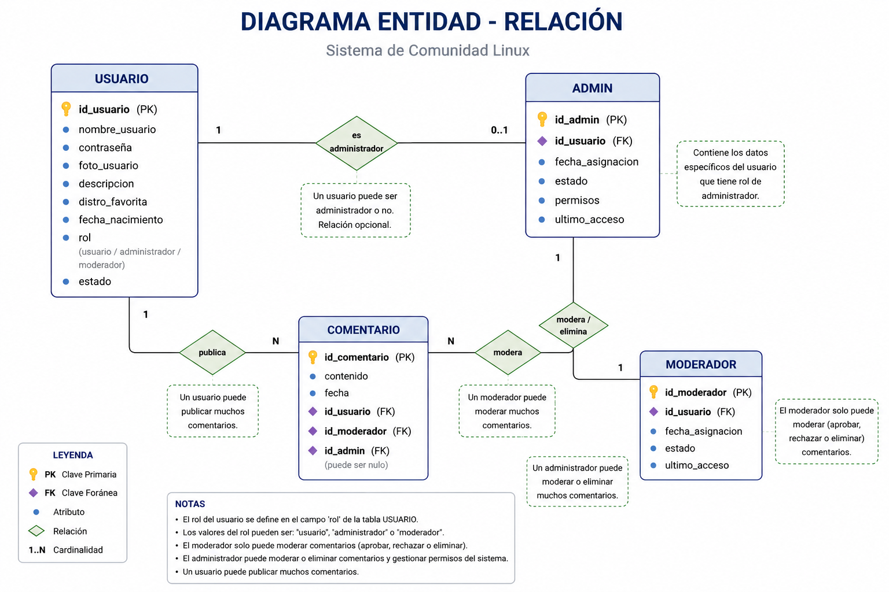

# Planificacion del apartado Foro - DistroVantix

## Objetivo

Agregar un apartado de foro a DistroVantix donde los usuarios registrados puedan publicar comentarios, participar con su cuenta y consultar conversaciones relacionadas con Linux, distribuciones, problemas tecnicos, recomendaciones y experiencias.

El foro debe mantener el enfoque del proyecto: ayudar a personas hispanohablantes que estan entrando al mundo Linux, con respuestas claras, comunidad activa y moderacion basica.

## Referencias del modelo

Esta planificacion se basa en dos referencias del proyecto:

- Diagrama entidad-relacion conceptual: `Diagrama_Entidad-Relacion.DistroVantix.png`
- Base de datos ya creada: captura del esquema con las tablas `usuario`, `comentario`, `admin` y `moderador`



El DER conceptual muestra la idea general del sistema: un usuario puede publicar muchos comentarios, un usuario puede tener rol de administrador o moderador, y administradores/moderadores pueden intervenir comentarios.

La base creada concreta ese modelo con tablas separadas para `admin` y `moderador`, relacionadas con `usuario` mediante `id_usuario`. Tambien se ve una relacion con `auth.users.id`, por lo que la autenticacion debe manejarse desde Supabase Auth y no desde un campo de contrasena dentro de `usuario`.

## Alcance inicial

El primer alcance del foro debe ser simple y funcional:

- Ver comentarios publicados por otros usuarios.
- Publicar comentarios usando una cuenta autenticada.
- Mostrar nombre, foto o avatar del usuario junto al comentario.
- Diferenciar usuarios normales, moderadores y administradores.
- Evitar comentarios anonimos.
- Permitir intervencion basica por moderadores y administradores.
- Preparar el sistema para estados de moderacion sin obligar a crear un foro complejo desde el primer dia.

No se recomienda empezar con categorias, publicaciones y respuestas anidadas. Primero conviene crear una version tipo "muro de comentarios" o "discusion general", y despues evolucionarla a un foro completo.

## Base de datos disponible

Segun el diagrama de la base ya creada, existen estas tablas principales:

### Tabla `usuario`

Campos observados en la base:

| Campo | Tipo observado | Uso recomendado |
| --- | --- | --- |
| `id_usuario` | `uuid` | Identificador del perfil. Debe corresponder al usuario autenticado de `auth.users.id`. |
| `nombre_usuario` | `text` | Nombre visible en el foro. |
| `foto_usuario` | `text` | URL o ruta de avatar/foto del usuario. |
| `descripcion` | `text` | Texto breve del perfil. |
| `distro_favorita` | `text` | Distro favorita para mostrar en comentarios o perfil. |
| `fecha_nacimiento` | `date` | Dato de perfil; no es obligatorio mostrarlo en el foro. |
| `estado` | `text` | Control de acceso: activo, suspendido, bloqueado, pendiente. |
| `rol` | `text` | Rol visible o funcional: usuario, moderador, administrador. |

Notas importantes:

- En el DER conceptual aparecia `contrasena`, pero en la base real no aparece. Esto es correcto si se usa Supabase Auth, porque la contrasena no debe guardarse manualmente en `usuario`.
- `id_usuario` debe vincularse con `auth.users.id`. Esa relacion aparece en la captura de la base.
- El campo `rol` permite distinguir permisos, pero para datos especificos de cada rol ya existen las tablas `admin` y `moderador`.

### Tabla `comentario`

Campos observados en la base:

| Campo | Tipo observado | Uso recomendado |
| --- | --- | --- |
| `id_comentario` | `int8` | Identificador del comentario. Parece ser el campo principal. |
| `fecha` | `timestamptz` | Fecha y hora de publicacion. |
| `contenido` | `text` | Texto publicado por el usuario. |
| `id_usuario` | `uuid` | Usuario autor del comentario. |
| `id_admin` | `uuid` | Administrador que intervino el comentario, si corresponde. |
| `id_moderador` | `uuid` | Moderador que intervino el comentario, si corresponde. |

Uso dentro del foro:

- Guardar cada comentario publicado.
- Relacionar el comentario con el usuario que lo escribio.
- Registrar intervencion de un administrador o moderador cuando haya moderacion.

Observacion critica:

- La tabla no muestra un campo `estado`. Para la primera version puede funcionar mostrando todos los comentarios, pero para moderar sin borrar conviene agregar `estado` en una etapa temprana.
- `id_admin` e `id_moderador` deben ser opcionales. Un comentario normal no deberia requerir moderacion para existir.

### Tabla `admin`

Campos observados en la base:

| Campo | Tipo observado | Uso recomendado |
| --- | --- | --- |
| `id_admin` | `uuid` | Identificador del registro de administrador. |
| `fecha_asignacion` | `timestamptz` | Fecha en que se asigno el rol. |
| `estado` | `text` | Estado del permiso administrativo. |
| `permisos` | `text` | Alcance de permisos del administrador. |
| `ultimo_acceso` | `timestamptz` | Ultima actividad administrativa. |
| `id_usuario` | `uuid` | Usuario asociado al administrador. |

Uso dentro del foro:

- Gestionar usuarios.
- Gestionar moderadores.
- Ocultar, eliminar o restaurar comentarios, si se implementa.
- Revisar actividad general del foro.

### Tabla `moderador`

Campos observados en la base:

| Campo | Tipo observado | Uso recomendado |
| --- | --- | --- |
| `id_moderador` | `uuid` | Identificador del registro de moderador. |
| `fecha_asignacion` | `timestamptz` | Fecha en que se asigno el rol. |
| `estado` | `text` | Estado del permiso de moderacion. |
| `ultimo_acceso` | `timestamptz` | Ultima actividad de moderacion. |
| `id_usuario` | `uuid` | Usuario asociado al moderador. |

Uso dentro del foro:

- Revisar comentarios reportados, cuando exista la tabla de reportes.
- Ocultar o marcar comentarios conflictivos, cuando exista `comentario.estado`.
- Mantener el orden de la comunidad sin modificar permisos globales.

## Relaciones del modelo

Relaciones principales segun el DER y la base creada:

- `usuario` 1 a N `comentario`: un usuario puede publicar muchos comentarios.
- `usuario` 1 a 0..1 `admin`: un usuario puede ser administrador o no.
- `usuario` 1 a 0..1 `moderador`: un usuario puede ser moderador o no.
- `admin` 1 a N `comentario`: un administrador puede intervenir muchos comentarios.
- `moderador` 1 a N `comentario`: un moderador puede intervenir muchos comentarios.
- `usuario.id_usuario` se relaciona con `auth.users.id`: el perfil local depende del usuario autenticado en Supabase.

Recomendacion de consistencia:

- Si `usuario.rol = administrador`, debe existir un registro activo en `admin`.
- Si `usuario.rol = moderador`, debe existir un registro activo en `moderador`.
- Si `usuario.rol = usuario`, no deberia tener registros activos en `admin` ni `moderador`.

## Funciones recomendadas para la primera version

### 1. Pagina principal del foro

Crear una pagina nueva llamada "Foro" dentro de la navegacion del sitio.

Contenido recomendado:

- Titulo: "Foro de la comunidad"
- Campo para escribir comentario, solo visible para usuarios con sesion iniciada.
- Lista de comentarios recientes.
- Mensaje para usuarios sin sesion: "Inicia sesion para participar".
- Estado de carga mientras se consultan comentarios.
- Mensaje claro si no hay comentarios.

### 2. Publicacion de comentarios

Flujo:

1. El usuario inicia sesion con Supabase Auth.
2. El sistema busca su perfil en `usuario` usando `auth.users.id`.
3. Entra al apartado Foro.
4. Escribe su comentario.
5. El sistema valida que el contenido no este vacio.
6. El sistema valida que `usuario.estado = activo`.
7. Se guarda el comentario con `id_usuario` y `fecha`.
8. El comentario aparece en la lista del foro.

Validaciones minimas:

- El comentario no puede estar vacio.
- Debe tener limite de caracteres.
- El usuario debe estar autenticado.
- El usuario debe estar activo.
- No permitir publicar si el usuario esta bloqueado, suspendido o pendiente.
- No aceptar HTML directo dentro del contenido.

### 3. Visualizacion de comentarios

Cada comentario deberia mostrar:

- Foto del usuario.
- Nombre de usuario.
- Distro favorita, si existe.
- Fecha del comentario.
- Contenido.
- Rol visible solo si es moderador o administrador.

Consulta logica recomendada:

```sql
select
  comentario.id_comentario,
  comentario.fecha,
  comentario.contenido,
  usuario.id_usuario,
  usuario.nombre_usuario,
  usuario.foto_usuario,
  usuario.distro_favorita,
  usuario.rol
from comentario
join usuario on usuario.id_usuario = comentario.id_usuario
order by comentario.fecha desc;
```

Ejemplo visual:

```text
[Foto] EnzoLinux
Distro favorita: Fedora
Publicado el 31/05/2026

Estoy probando KDE y me parece mas comodo para venir de Windows.
```

### 4. Moderacion

Con la base actual, `comentario.id_admin` e `comentario.id_moderador` pueden registrar quien intervino, pero falta saber que accion se hizo. Por eso, la moderacion completa necesita al menos un campo `estado` o una tabla de historial.

Acciones recomendadas para moderadores:

- Ocultar comentario, cuando exista `comentario.estado`.
- Marcar comentario como revisado.
- Ver autor, fecha y contenido.
- No cambiar roles ni permisos globales.

Acciones recomendadas para administradores:

- Todas las acciones del moderador.
- Suspender usuario.
- Cambiar rol de usuario.
- Gestionar permisos.
- Ver historial de moderacion, si se implementa.

## Estados recomendados

Aunque la base ya tiene campos `estado` en `usuario`, `admin` y `moderador`, conviene definir valores claros.

### Estado de usuario

Valores sugeridos:

- `activo`
- `suspendido`
- `bloqueado`
- `pendiente`

### Estado de admin o moderador

Valores sugeridos:

- `activo`
- `inactivo`
- `revocado`

### Estado de comentario

En la base actual no se ve un campo `estado` en `comentario`. Se recomienda agregarlo para poder moderar sin eliminar registros.

Valores sugeridos:

- `publicado`
- `oculto`
- `eliminado`
- `pendiente_revision`

Campo recomendado:

```sql
alter table comentario
add column estado text not null default 'publicado';
```

## Mejora recomendada de la base de datos

La tabla `comentario` permite crear un foro basico, pero para que el sistema sea mas controlable conviene agregar algunas mejoras.

### Mejora prioritaria: `comentario.estado`

Permite ocultar o revisar comentarios sin borrarlos.

Campos afectados:

- `comentario.estado`
- `comentario.id_admin`
- `comentario.id_moderador`

Uso esperado:

- Al publicar: `estado = publicado`
- Al ocultar por moderador: `estado = oculto`, `id_moderador = moderador actual`
- Al ocultar por administrador: `estado = oculto`, `id_admin = admin actual`

### Mejora recomendada: historial de moderacion

La base actual solo permite guardar un admin o moderador asociado al comentario. Si se quiere guardar cada accion, conviene crear una tabla nueva.

Tabla sugerida: `historial_moderacion`

Campos sugeridos:

- `id_historial`
- `id_comentario`
- `id_usuario_accion`
- `rol_accion`
- `accion`
- `motivo`
- `fecha`

### Tabla futura: `publicacion`

Serviria para crear temas o preguntas principales.

Campos sugeridos:

- `id_publicacion`
- `titulo`
- `contenido`
- `fecha`
- `estado`
- `id_usuario`
- `id_categoria`

### Tabla futura: `categoria_foro`

Serviria para ordenar las conversaciones.

Categorias posibles:

- Primeros pasos en Linux
- Recomendaciones de distros
- Gaming en Linux
- Trabajo y productividad
- Personalizacion
- Problemas tecnicos
- Ciberseguridad

Campos sugeridos:

- `id_categoria`
- `nombre`
- `descripcion`
- `estado`

### Tabla futura: `reporte_comentario`

Serviria para que los usuarios reporten contenido.

Campos sugeridos:

- `id_reporte`
- `motivo`
- `fecha`
- `estado`
- `id_comentario`
- `id_usuario`

## Flujo de permisos

### Usuario normal

Puede:

- Ver el foro.
- Publicar comentarios.
- Editar sus propios comentarios, si se implementa.
- Eliminar sus propios comentarios, si se implementa.
- Reportar comentarios, si se implementa.

No puede:

- Editar comentarios de otros.
- Ocultar comentarios de otros.
- Cambiar roles.
- Modificar datos de `admin` o `moderador`.

### Moderador

Puede:

- Ver comentarios.
- Ocultar comentarios, si existe `comentario.estado`.
- Revisar reportes, si existe `reporte_comentario`.
- Marcar contenido como revisado.

No deberia poder:

- Cambiar administradores.
- Borrar usuarios definitivamente.
- Modificar permisos globales.
- Asignarse permisos a si mismo.

### Administrador

Puede:

- Gestionar usuarios.
- Gestionar moderadores.
- Gestionar comentarios.
- Cambiar estados.
- Revisar actividad del foro.
- Gestionar permisos administrativos.

## Integracion con la pagina actual

El proyecto actual esta organizado con:

- Archivos HTML en `HTML/`
- Estilos en `CSS/`
- JavaScript en `JS/`
- Imagenes en `IMGS/`
- Documentacion y diagrama DER en la raiz del proyecto

Para mantener el orden, cuando se implemente el foro se recomienda crear:

- `HTML/Foro.html`
- `CSS/Foro.css`
- `JS/Foro.js`

Tambien habria que agregar el enlace "Foro" en la navegacion principal o sidebar existente.

## Diseno recomendado

El foro deberia mantener el estilo visual de DistroVantix:

- Fondo coherente con el resto del sitio.
- Tarjetas simples para comentarios.
- Avatar del usuario a la izquierda.
- Nombre y rol arriba del comentario.
- Botones discretos para publicar, editar, reportar o moderar.
- Buena lectura en celular.

Elementos visuales minimos:

- Caja para escribir comentario.
- Boton "Publicar".
- Lista de comentarios.
- Estado de carga.
- Mensaje si no hay comentarios.
- Mensaje si el usuario no inicio sesion.

## Seguridad y reglas basicas

Puntos importantes:

- No confiar solo en validaciones del frontend.
- Validar permisos en politicas de Supabase o en backend.
- Evitar que usuarios no autenticados publiquen.
- Evitar que un usuario edite comentarios de otro.
- Limitar longitud de comentarios.
- Sanitizar contenido para evitar inyeccion de HTML o scripts.
- Registrar quien modera cada comentario.
- No guardar contrasenas en la tabla `usuario`; eso corresponde a Supabase Auth.

## Politicas recomendadas para Supabase

Como la base esta relacionada con `auth.users.id`, conviene usar Row Level Security.

Reglas sugeridas:

- Cualquier visitante puede leer comentarios con `estado = publicado`, cuando exista ese campo.
- Solo usuarios autenticados pueden insertar comentarios.
- Un usuario solo puede insertar comentarios con su propio `id_usuario`.
- Un usuario solo puede editar o eliminar sus propios comentarios, si se habilita esa funcion.
- Moderadores activos pueden ocultar comentarios.
- Administradores activos pueden gestionar comentarios, usuarios y roles.

Condiciones conceptuales:

```sql
-- El perfil del usuario debe coincidir con la sesion actual.
usuario.id_usuario = auth.uid()

-- El autor del comentario debe coincidir con la sesion actual.
comentario.id_usuario = auth.uid()
```

Estas reglas deberian configurarse y probarse antes de poner el foro en produccion.

## Etapas de implementacion

### Etapa 1: Foro basico

- Confirmar que `usuario.id_usuario` coincide con `auth.users.id`.
- Crear pagina del foro.
- Mostrar comentarios existentes.
- Permitir publicar comentarios con usuario autenticado.
- Mostrar nombre, foto y distro favorita del usuario.

### Etapa 2: Moderacion minima

- Agregar `estado` a `comentario`.
- Mostrar solo comentarios publicados.
- Permitir ocultar comentarios.
- Registrar `id_admin` o `id_moderador` cuando haya intervencion.
- Agregar controles visibles solo para moderador y admin.

### Etapa 3: Comunidad mas completa

- Agregar categorias.
- Agregar publicaciones o temas.
- Permitir respuestas a publicaciones.
- Agregar reportes.
- Agregar perfil publico del usuario.

### Etapa 4: Mejoras de experiencia

- Buscador.
- Filtros por categoria.
- Paginacion o carga progresiva.
- Notificaciones.
- Reacciones o votos utiles.

## Prioridad recomendada

Orden recomendado para avanzar:

1. Confirmar autenticacion con Supabase Auth.
2. Confirmar que `usuario.id_usuario` esta conectado correctamente con `auth.users.id`.
3. Agregar `estado` a `comentario`.
4. Crear la pagina visual del foro.
5. Conectar lectura de comentarios.
6. Conectar publicacion de comentarios.
7. Agregar reglas de seguridad.
8. Agregar moderacion.
9. Mejorar estructura con categorias y publicaciones.

## Riesgos

- La tabla `comentario` todavia es basica para un foro completo.
- Si no hay campo `estado` en comentarios, moderar sin borrar sera dificil.
- Si no hay autenticacion integrada en la pagina actual, primero hay que resolver login y registro.
- Si se permite HTML dentro de comentarios, puede haber riesgos de seguridad.
- Si no se usan politicas de seguridad, cualquier usuario podria intentar modificar datos que no le pertenecen.
- Si `usuario.rol` no se mantiene sincronizado con `admin` y `moderador`, puede haber inconsistencias de permisos.

## Decision recomendada

Para empezar, conviene implementar un foro simple de comentarios generales usando las tablas actuales:

- `usuario`
- `comentario`
- `admin`
- `moderador`

Antes de construir funciones avanzadas, conviene agregar `estado` en `comentario` y confirmar la relacion entre `usuario.id_usuario` y `auth.users.id`.

Despues, cuando el flujo basico funcione, agregar:

- `categoria_foro`
- `publicacion`
- `reporte_comentario`
- `historial_moderacion`

Esta estrategia permite avanzar sin rehacer toda la base de datos desde el principio y mantiene la documentacion alineada con el DER y con la base ya creada.

## Correccion aplicada el 31/05/2026

Se corrigio el error de publicacion del foro que mostraba el mensaje:

`Error de insercion. Verifica las restricciones de la tabla.`

### Causa detectada

El archivo `JS/Foro.js` estaba intentando insertar comentarios enviando solo el campo `contenido`.

La tabla `comentario` esta relacionada con `usuario` mediante `id_usuario`, por lo que la insercion puede fallar si ese campo es obligatorio o si existe una Foreign Key contra `usuario.id_usuario`.

Tambien se detectaron dos inconsistencias de frontend:

- El cliente de Supabase se creaba como `_supabase`, pero el resto del codigo usaba `supabaseClient`.
- El JavaScript buscaba `profile-card`, `profile-avatar`, `profile-username`, `profile-distro`, `profile-status` y `profile-role`, pero el HTML no tenia todos esos ids.

### Cambios realizados

- Se cambio la inicializacion a `const supabaseClient = supabase.createClient(...)`.
- Se agrego un usuario demo centralizado en `usuarioDemo`.
- La insercion ahora envia `contenido`, `id_usuario` y, si existe en la tabla, `estado = publicado`.
- Si la columna `estado` no existe todavia, el codigo reintenta la lectura o insercion sin esa columna para mantener compatibilidad con la base actual.
- Se agregaron mensajes de error mas especificos para detectar problemas de Foreign Key, campos obligatorios o politicas RLS de Supabase.
- Se agrego escape de HTML al renderizar comentarios para evitar que un comentario inserte etiquetas HTML en la pagina.
- Se agregaron los ids faltantes en `HTML/Foro.html` para que la tarjeta de perfil pueda actualizarse desde `JS/Foro.js`.

### Archivos modificados

- `JS/Foro.js`
- `HTML/Foro.html`
- `Planificacion_Foro_DistroVantix.md`

### Backup creado

Antes de modificar los archivos se creo una copia en:

`backups/foro-2026-05-31/`

Archivos guardados:

- `backups/foro-2026-05-31/Foro.js.bak`
- `backups/foro-2026-05-31/Foro.html.bak`
- `backups/foro-2026-05-31/Planificacion_Foro_DistroVantix.md.bak`

### Nota pendiente de base de datos

El UUID usado por el usuario demo es:

`a900d46f-0726-4077-bfeb-076cbde2ad56`

Ese UUID debe existir en la tabla `usuario.id_usuario`. Si no existe, Supabase seguira rechazando la insercion por Foreign Key. Si Row Level Security esta activado, tambien sera necesario iniciar sesion con Supabase Auth y que `auth.uid()` coincida con el mismo `id_usuario`.

## Correccion RLS aplicada el 31/05/2026

Despues de corregir el `id_usuario`, Supabase siguio devolviendo:

`Error: Supabase bloqueo la insercion por politicas de seguridad.`

### Causa detectada

El boton anterior de "Iniciar sesion" solo simulaba una sesion en pantalla. No iniciaba sesion real con Supabase Auth, por lo que `auth.uid()` era `null` y cualquier policy de RLS que pidiera usuario autenticado bloqueaba el `insert`.

### Cambios realizados

- Se agrego un formulario real de autenticacion en `HTML/Foro.html` con email y contrasena.
- Se agregaron botones para iniciar sesion y crear cuenta con Supabase Auth.
- `JS/Foro.js` ahora usa `supabaseClient.auth.getSession()`, `signInWithPassword()`, `signUp()` y `signOut()`.
- Al publicar, `id_usuario` sale de la sesion real de Supabase, no de un UUID simulado.
- Se agrego busqueda del perfil local en la tabla `usuario`.
- Si el perfil local no existe, el frontend intenta crearlo con `id_usuario = auth.users.id`.
- Se agregaron estilos para el formulario de acceso en `CSS/Foro.css`.
- Se agrego CSS explicito para que `hidden` oculte correctamente el formulario de login o el formulario de comentario segun el estado de sesion.

### Backup creado

Antes de esta segunda correccion se creo una copia en:

`backups/foro-2026-05-31-rls/`

Archivos guardados:

- `backups/foro-2026-05-31-rls/Foro.js.bak`
- `backups/foro-2026-05-31-rls/Foro.html.bak`
- `backups/foro-2026-05-31-rls/Foro.css.bak`
- `backups/foro-2026-05-31-rls/Planificacion_Foro_DistroVantix.md.bak`

### SQL necesario en Supabase

El frontend queda preparado, pero la base debe tener policies compatibles. Ejecutar en el SQL Editor de Supabase y ajustar nombres si alguna columna cambia.

```sql
alter table usuario enable row level security;
alter table comentario enable row level security;

drop policy if exists "Usuarios pueden leer perfiles" on usuario;
create policy "Usuarios pueden leer perfiles"
on usuario
for select
to anon, authenticated
using (true);

drop policy if exists "Usuarios pueden crear su perfil" on usuario;
create policy "Usuarios pueden crear su perfil"
on usuario
for insert
to authenticated
with check (id_usuario = auth.uid());

drop policy if exists "Usuarios pueden actualizar su perfil" on usuario;
create policy "Usuarios pueden actualizar su perfil"
on usuario
for update
to authenticated
using (id_usuario = auth.uid())
with check (id_usuario = auth.uid());

drop policy if exists "Todos pueden leer comentarios" on comentario;
create policy "Todos pueden leer comentarios"
on comentario
for select
to anon, authenticated
using (true);

drop policy if exists "Usuarios pueden publicar comentarios" on comentario;
create policy "Usuarios pueden publicar comentarios"
on comentario
for insert
to authenticated
with check (id_usuario = auth.uid());
```

Si la tabla `comentario` tiene la columna `estado` y se quiere obligar a publicar solo comentarios visibles, la ultima policy puede endurecerse asi:

```sql
drop policy if exists "Usuarios pueden publicar comentarios" on comentario;
create policy "Usuarios pueden publicar comentarios"
on comentario
for insert
to authenticated
with check (id_usuario = auth.uid() and estado = 'publicado');
```

### Nota importante

Si Supabase exige confirmacion por email, despues de crear la cuenta hay que confirmar el correo antes de iniciar sesion. Hasta que exista una sesion real, RLS seguira bloqueando la publicacion.

## Correccion de policies aplicada el 31/05/2026

El login real ya funcionaba, pero Supabase seguia bloqueando la publicacion de comentarios. Eso confirma que el problema restante esta en las policies de la base, no en el estado de sesion del frontend.

### Cambios realizados

- Se creo el archivo `sql/foro_policies_supabase.sql` con las policies necesarias para `usuario` y `comentario`.
- El mensaje de error del frontend ahora indica ejecutar `sql/foro_policies_supabase.sql` en el SQL Editor de Supabase.
- Se agrego un `console.info` antes de publicar para mostrar el UUID real de la sesion que Supabase Auth esta usando.

### Backup creado

Antes de esta correccion se creo una copia en:

`backups/foro-2026-05-31-policy/`

Archivos guardados:

- `backups/foro-2026-05-31-policy/Foro.js.bak`
- `backups/foro-2026-05-31-policy/Planificacion_Foro_DistroVantix.md.bak`

### Accion necesaria fuera del codigo

Abrir Supabase Dashboard, ir a SQL Editor, pegar el contenido de `sql/foro_policies_supabase.sql` y ejecutarlo.

Despues de ejecutar ese SQL, cerrar sesion en el foro, volver a iniciar sesion y publicar el comentario de nuevo.

## Acceso beta aplicado el 31/05/2026

Se agrego una forma mas rapida de entrar al foro para pruebas sin escribir email y contrasena manualmente.

### Cambios realizados

- Se agrego el boton `Entrar como beta` en `HTML/Foro.html`.
- Se agregaron estilos para el boton beta en `CSS/Foro.css`.
- Se agrego en `JS/Foro.js` una cuenta de prueba:
  - Email: `beta@distrovantix.test`
  - Contrasena: `BetaDistroVantix2026!`
- El boton beta intenta iniciar sesion con esa cuenta.
- Si la cuenta beta no existe, el frontend intenta crearla con Supabase Auth.
- Si Supabase exige confirmacion por email, la cuenta beta debe crearse o confirmarse desde el panel de Supabase.

### Backup creado

Antes de esta correccion se creo una copia en:

`backups/foro-2026-05-31-beta/`

Archivos guardados:

- `backups/foro-2026-05-31-beta/Foro.js.bak`
- `backups/foro-2026-05-31-beta/Foro.html.bak`
- `backups/foro-2026-05-31-beta/Foro.css.bak`
- `backups/foro-2026-05-31-beta/Planificacion_Foro_DistroVantix.md.bak`

### Nota de seguridad

Esta cuenta beta sirve solo para pruebas del proyecto. No conviene dejar credenciales fijas en JavaScript publico si el foro se publica en internet.

### Condicion necesaria

El acceso beta sigue usando Supabase Auth real, por lo que las policies de `sql/foro_policies_supabase.sql` siguen siendo necesarias para publicar comentarios.

## Correccion acceso beta anonimo aplicada el 31/05/2026

El boton beta devolvia:

`No se pudo entrar como beta: email rate limit exceeded`

### Causa detectada

El flujo anterior intentaba crear la cuenta beta por email si el login fallaba. Supabase limita esos intentos y bloquea temporalmente nuevas solicitudes de autenticacion por email.

### Cambios realizados

- El boton `Entrar como beta` ahora intenta primero `supabaseClient.auth.signInAnonymously()`.
- Si el acceso anonimo no esta habilitado en Supabase, recien ahi intenta iniciar sesion con la cuenta beta existente.
- Ya no intenta crear la cuenta beta automaticamente por email, para evitar volver a disparar el rate limit.
- Los usuarios anonimos se muestran como `Usuario Beta` con avatar `BT`.
- El mensaje de error ahora indica habilitar Anonymous Sign-Ins o crear manualmente la cuenta beta.

### Backup creado

Antes de esta correccion se creo una copia en:

`backups/foro-2026-05-31-beta-anon/`

Archivos guardados:

- `backups/foro-2026-05-31-beta-anon/Foro.js.bak`
- `backups/foro-2026-05-31-beta-anon/Planificacion_Foro_DistroVantix.md.bak`

### Accion necesaria en Supabase

Para que el boton beta funcione sin email ni contrasena, habilitar:

`Supabase Dashboard > Authentication > Providers > Anonymous Sign-Ins`

Las policies de `sql/foro_policies_supabase.sql` siguen siendo necesarias, porque el usuario anonimo igualmente publica como usuario autenticado.

## Modo beta local aplicado el 31/05/2026

Como Supabase tampoco tenia habilitado Anonymous Sign-Ins, el boton beta seguia sin poder crear una sesion real.

### Cambios realizados

- Se agrego un fallback de `Entrar como beta` a modo local.
- Si falla el acceso anonimo y tambien falla la cuenta beta por email, el foro entra como `Usuario Beta`.
- En este modo, el formulario de comentario se habilita sin depender de Supabase Auth.
- Los comentarios beta se guardan en `localStorage` con la clave `distrovantix_comentarios_beta`.
- La lista de comentarios mezcla primero los comentarios beta locales y despues los comentarios que vengan de Supabase.
- Al publicar en modo beta local, se muestra `Comentario beta guardado localmente.`

### Backup creado

Antes de esta correccion se creo una copia en:

`backups/foro-2026-05-31-beta-local/`

Archivos guardados:

- `backups/foro-2026-05-31-beta-local/Foro.js.bak`
- `backups/foro-2026-05-31-beta-local/Planificacion_Foro_DistroVantix.md.bak`

### Alcance

Este modo sirve para probar rapidamente la interfaz de publicar y listar comentarios. No escribe en Supabase y no reemplaza la configuracion real de Auth/RLS para produccion.

## Rediseño de autenticacion aplicado el 31/05/2026

Se rehizo el flujo del foro para trabajar con cuentas reales y registrar perfiles en la tabla `usuario` mostrada en la captura de Supabase.

### Cambios realizados

- Se elimino el acceso beta/local del formulario principal.
- Se agrego un selector entre `Iniciar sesion` y `Crear cuenta`.
- El registro ahora pide:
  - Email
  - Contrasena
  - Nombre de usuario
  - Distro favorita
  - Descripcion
  - Foto o avatar
  - Fecha de nacimiento
- Al crear cuenta se usa Supabase Auth con metadatos del perfil.
- Si hay sesion inmediata, el frontend inserta o actualiza el registro en `usuario`.
- Al iniciar sesion se busca el perfil en `usuario`; si no existe, se crea con los datos disponibles en Auth.
- Los comentarios publicados consultan autores desde la tabla `usuario`.
- La publicacion de comentarios usa `comentario.id_usuario = usuario.id_usuario = auth.users.id`.
- Se actualizo `sql/foro_policies_supabase.sql` con policies y un trigger para crear perfiles automaticamente desde `auth.users`.

### Archivos modificados

- `HTML/Foro.html`
- `CSS/Foro.css`
- `JS/Foro.js`
- `sql/foro_policies_supabase.sql`
- `Planificacion_Foro_DistroVantix.md`

### Backup creado

Antes de esta correccion se creo una copia en:

`backups/foro-2026-05-31-auth-redesign/`

Archivos guardados:

- `backups/foro-2026-05-31-auth-redesign/Foro.html.bak`
- `backups/foro-2026-05-31-auth-redesign/Foro.css.bak`
- `backups/foro-2026-05-31-auth-redesign/Foro.js.bak`
- `backups/foro-2026-05-31-auth-redesign/Planificacion_Foro_DistroVantix.md.bak`
- `backups/foro-2026-05-31-auth-redesign/foro_policies_supabase.sql.bak`

### Accion necesaria en Supabase

Ejecutar nuevamente el archivo:

`sql/foro_policies_supabase.sql`

Esto crea o actualiza:

- Policies de lectura, insercion y actualizacion para `usuario`.
- Policies de lectura, insercion y actualizacion para `comentario`.
- Trigger `crear_perfil_usuario_auth` sobre `auth.users` para crear automaticamente registros en `usuario`.

Si Supabase tiene confirmacion de email activada, el usuario debe confirmar su email antes de iniciar sesion. El trigger deja preparado el perfil en `usuario` aunque el frontend no tenga sesion inmediata.

## Actualizacion visual del foro aplicada el 31/05/2026

Se mejoro la presentacion de la seccion de foro sin modificar la estructura HTML ni la logica JavaScript.

### Cambios realizados

- Se reemplazo `CSS/Foro.css` por una hoja de estilos mas completa y ordenada.
- Se agregaron variables CSS para colores, bordes, sombras y radios.
- Se mejoro el fondo general, la barra superior, el bloque principal del muro, el formulario de publicacion, la lista de comentarios, la tarjeta de usuario y el modal de acceso.
- Se agregaron estados `hover`, `active` y `focus-visible` para botones, inputs y textarea.
- Se mejoro la lectura de comentarios con tarjetas mas definidas, acento lateral y mejor espaciado.
- Se agrego soporte responsive para pantallas medianas y celulares.
- Se mantuvieron los mismos nombres de clases usados por `HTML/Foro.html` y `JS/Foro.js`.

### Archivo modificado

- `CSS/Foro.css`

### Alcance

Esta actualizacion es solo visual y documental. No cambia consultas a Supabase, autenticacion, publicacion de comentarios, policies ni estructura de base de datos.

## DOCUMENTACIÓN TÉCNICA DE DESARROLLO - DISTROVANTIX (FORO)
Estado del proyecto: Acto III (Implementación de lógica y seguridad avanzada)

Base de Datos / Backend: Supabase (PostgreSQL + Auth)

Frontend: HTML5, CSS3 (Estilo moderno oscuro) y JavaScript Vanila (ES6+)

📅 1. LO QUE YA HICIMOS (Logros Actuales)
Hoy resolvimos los dos problemas más críticos del foro: el efecto cascada/duplicado en la interfaz y la falta de interactividad del perfil del usuario, aplicando seguridad a nivel de base de datos.

A. Corrección del Error de Renderizado ("Efecto Eco")
Problema: Al refrescar la página (F5), los comentarios se duplicaban en pantalla de manera visual, aunque en Supabase existía un solo registro real. Esto pasaba porque el evento DOMContentLoaded y el listener onAuthStateChange de Supabase se ejecutaban en paralelo, lanzando dos peticiones síncronas que se pisaban.

Solución: Centralizamos el flujo en el inicio controlado de la aplicación abajo de todo del script, quitando la llamada repetida del bloque finally de la verificación de sesión. Además, añadimos un vaciado forzado obligatorio (commentList.innerHTML = "";) al inicio de la función cargarComentarios().

B. Implementación de Políticas de Seguridad RLS (Row Level Security)
Configuramos la base de datos en la nube de Supabase para blindar las tablas y definir qué acciones puede hacer cada rol:

Tabla comentario:

SELECT: Habilitado público para que cualquier visitante lea los aportes.

INSERT: Permitido únicamente a usuarios autenticados (authenticated).

UPDATE y DELETE: Protegidos mediante la expresión SQL id_usuario = auth.uid(). Solo el creador del comentario puede editarlo o borrarlo.

Tabla usuario:

SELECT: Lectura global para renderizar nicks y avatares.

INSERT: Permitido (true) para no bloquear el guardado de perfiles en el registro.

UPDATE: Condicionado a id_usuario = auth.uid() mediante bloques USING y WITH CHECK para que cada usuario edite únicamente su propia información.

C. Evolución del Sistema de Comentarios (CRUD Completo)
Modificamos la consulta de JavaScript mediante un JOIN simple que cruza los datos de comentario con la tabla usuario. Esto permite pintar el nick y avatar en tiempo real.

Añadimos una validación lógica (esMio) que inyecta dinámicamente los botones "Editar" y "Eliminar" solo en las tarjetas que pertenezcan al usuario que inició sesión.

Diseñamos la edición interactiva "In-line" (en caliente): al darle a editar, el texto plano se transforma en un textarea editable dentro del muro con botones de Guardar y Cancelar.

D. Sistema de Personalización de Perfil
Diseñamos e inyectamos un segundo modal interactivo (#profile-modal) en el HTML para la configuración de la cuenta.

Programamos la lógica en JavaScript que toma el nuevo Nick y el emoji de avatar seleccionado por el usuario, actualiza la fila correspondiente en la base de datos y refresca la interfaz sin perder la sesión.

🚀 2. PASOS A SEGUIR PARA CONTINUAR (Hoja de Ruta)
Como el tiempo apremia, esta es la lista de prioridades técnicas ordenadas de mayor a menor importancia para dejar el foro impecable:

🟩 Paso A: Estilar los nuevos elementos en CSS (CSS/Foro.css)
El HTML ahora tiene componentes nuevos que necesitan heredar la estética oscura del sitio:

Los botones Editar y Eliminar: Darles un diseño más prolijo con transiciones suaves (transition: 0.2s;), quitando los estilos en línea (style="") que usamos para la prueba rápida.

El Textarea de edición dentro del muro: Asegurarse de que use las variables de color del tema (los fondos oscuros #11111b y los bordes lavanda/morados).

El Modal de Perfil: Verificar que se vea idéntico al modal de Login para mantener la consistencia visual.

🟨 Paso B: Validaciones de Seguridad en el Frontend
Para evitar que los usuarios rompan la interfaz o envíen datos inválidos:

Control de espacios vacíos: Bloquear el botón de "Guardar" si el usuario intenta dejar su Nick en blanco o si borra todo el texto al editar un comentario.

Sanitización básica: Asegurarse de que si un usuario escribe código HTML en su comentario (ej: <script>...</script>), el sistema lo muestre como texto plano y no ejecute scripts maliciosos (XSS), usando .textContent en lugar de .innerHTML para el cuerpo del mensaje.

🟧 Paso C: Mejoras de UX (Experiencia de Usuario)
Mensajes de confirmación limpios: Reemplazar el confirm() nativo del navegador (el cartel gris feo que salta al borrar) por una transición o un aviso integrado más elegante.

Fechas relativas: En lugar de mostrar la fecha estática "03/06/2026 17:40", implementar una función simple que diga "Hace 5 minutos", "Hace 2 horas" o "Ayer", lo que le da mucha más vida de foro real a la comunidad.

## Avance aplicado el 03/06/2026

Se continuo la ruta indicada en la documentacion tecnica del foro, priorizando los pasos A, B y C.

### Cambios realizados

- Se reemplazo el renderizado de comentarios basado en `innerHTML` por creacion de nodos DOM y asignacion con `textContent` para el contenido escrito por usuarios.
- La consulta de comentarios ahora trae datos del autor desde `usuario`: `nombre_usuario`, `foto_usuario`, `distro_favorita` y `rol`.
- Se agregaron botones `Editar` y `Eliminar` solo para comentarios propios.
- Se implemento edicion inline con textarea, validacion para evitar comentarios vacios y botones `Guardar` y `Cancelar`.
- Se reemplazo la confirmacion nativa de eliminacion por un aviso integrado dentro de la tarjeta del comentario.
- Se agregaron fechas relativas: `Ahora`, `Hace X min`, `Hace X h`, `Ayer` o fecha corta para comentarios antiguos.
- Se agrego un modal de perfil para editar `nombre_usuario` y `foto_usuario`.
- Se agregaron estilos para acciones de comentario, textarea de edicion, confirmacion de borrado y boton/modal de perfil.
- Se agrego policy `DELETE` para que cada usuario autenticado pueda eliminar solo sus propios comentarios.

### Archivos modificados

- `JS/Foro.js`
- `HTML/Foro.html`
- `CSS/Foro.css`
- `sql/foro_policies_supabase.sql`
- `Planificacion_Foro_DistroVantix.md`

### Verificacion local

Se ejecuto:

```bash
node --check JS/Foro.js
```

El archivo JavaScript no presento errores de sintaxis.

### Estado funcional confirmado

El flujo ya se encuentra en funcionamiento:

- Los usuarios pueden editar su nombre de perfil desde el foro.
- Los usuarios autenticados pueden publicar comentarios.
- Los comentarios publicados quedan visibles para otros usuarios.
- Cada usuario puede editar sus propios comentarios.
- Cada usuario puede eliminar sus propios comentarios.
- Los botones de edicion y eliminacion solo aparecen en comentarios propios.

Esto confirma que Supabase Auth, la tabla `usuario`, la tabla `comentario` y las policies RLS necesarias para el CRUD propio estan trabajando de forma coordinada.

### Estado de Supabase

Las policies de lectura, insercion, actualizacion y eliminacion de comentarios propios ya quedaron validadas en uso real.

La policy importante para eliminacion es:

```sql
create policy "Usuarios pueden eliminar sus comentarios"
on public.comentario
for delete
to authenticated
using (id_usuario = auth.uid());
```

### Proxima ruta recomendada

1. Agregar moderacion minima: ocultar comentarios con `estado = oculto` en lugar de eliminarlos definitivamente.
2. Agregar controles visibles solo para `moderador` y `administrador`.
3. Registrar quien intervino cada comentario usando `id_moderador` o `id_admin`.
4. Preparar una vista simple para revisar comentarios ocultos o intervenidos.
5. Evaluar una tabla `historial_moderacion` si se necesita guardar cada accion administrativa.
